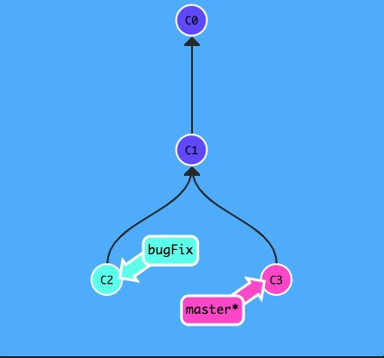
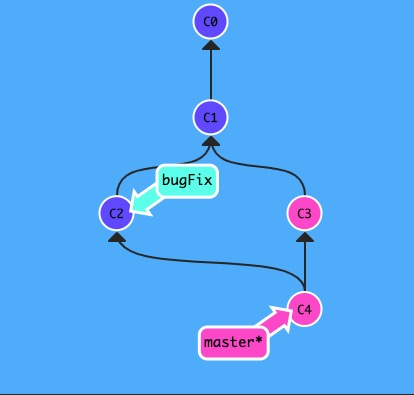
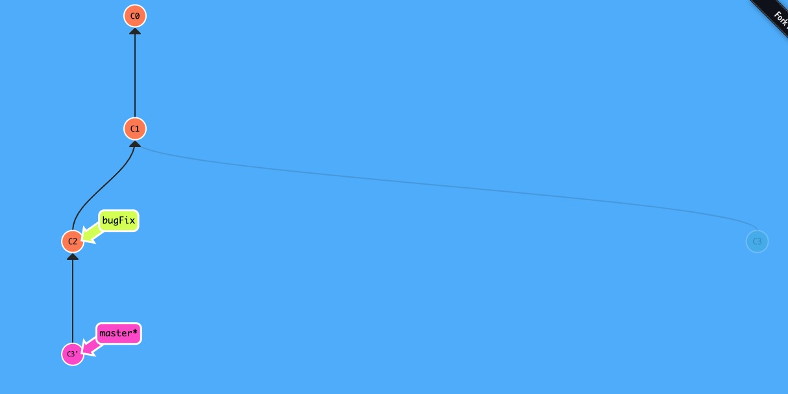
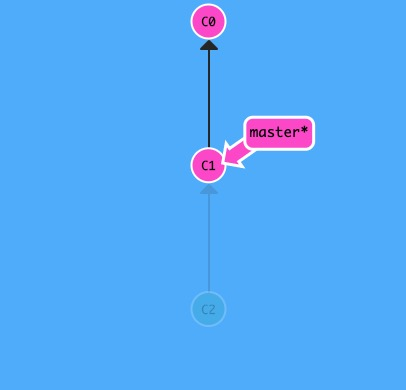
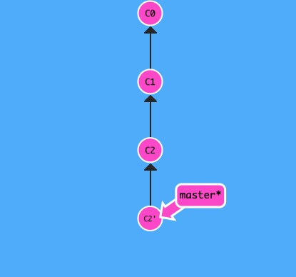

# 基础概念

## 创建分支

创建分支有下面两种方式, 第二种的好处是创建分支并切换到该分支.

```bash
git branch feature/xxx

git checkout -b feature/xxx
```

## merge 和 rebase 的区别

考察下图这个情形, 欲将 bugFix 分支合并到 master 分支:



### merge

merge 会创建一个新的 commit, 此时 master 现在指向了一个拥有两个父节点的提交记录. 假如从 master 开始沿着箭头向上看, 在到达起点的路上会经过所有的提交记录. 这意味着 master 包含了对代码库的所有修改.



### rebase

rebase 实际上就是取出一系列的提交记录, "复制"它们, 然后在另外一个地方逐个的放下去. rebase 的优势就是可以创造更线性的提交历史.



## 分离的 Head

分离的 Head 是指你可以 checkout 到指定的 commit 而非 branch.

```bash
git checkout 1e2f53

git checkout HEAD^

git checkout master^

git checkout HEAD~4

# 强制修改分支位置
# 下面的命令会将 master 分支强制指向 HEAD 的第 3 级父提交
git branch -f master HEAD~3
```

## 撤销修改之 revert VS reset

一言以蔽之: git reset 是把 HEAD 向后移动, 而 git revert 是 HEAD 继续前进. git reset 就是回退到上一次提交, 本次提交就被删掉了(实际被删掉的 commit 被放到了暂存区, 并未被完全移除); git revert 会创建一个新的 commit, 使这个新的 commit 跟上一次提交相同.

下面的图例中, 左图为 reset, 右图为 revert




## cherry-pick

用于将某些次提交合并到一个分支, 比如在 feature/a 提交了三个 commit, 分别是 5e2e1f0, cdc0c1e, a7fef64, 我想取前两个提交合并到另一个分支 feature/b, 可以这么做:

```bash
git checkout feature/b

git cherry-pick 5e2e1f0 cdc0c1e
```
