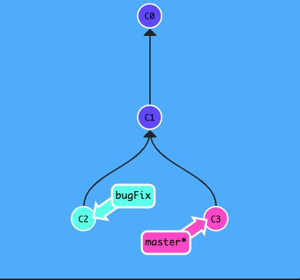

# 基础概念

## 创建分支

创建分支有下面两种方式, 第二种的好处是创建分支并切换到该分支.

```batch
git branch feature/xxx

git checkout -b feature/xxx
```

## merge 和 rebase 的区别

merge 会创建一个新的 commit, 将被合并与合并分支都指向这个新的 commit, 下面两张图是执行 `git merge bugFix`



