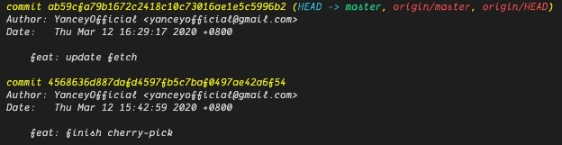
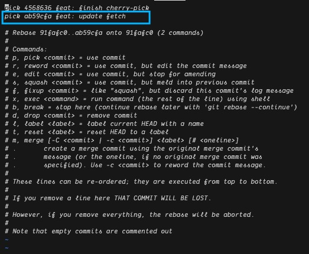

# 删除已提交至远端的 commit

如果不小心把密码、私钥之类的提交到远程仓库, 那就需要把相关的 commit 删除掉.

## 步骤 1

首先你要继续提交一个 commit, 这个 commit 是为了把这次 bug 解决掉, 下图中, 假设 `feat: update fetch` 是修复的 commit, `feat: finish cherry-pick` 是错误的 commit



## 步骤 2

执行下面这句, 如下图所示, 进入 vim, 将蓝框这一条删除掉, 保存即可. 此时有可能会产生冲突, 解决就是了.

```bash
# 因为倒数第二个 commit 有误, 所以是 `HEAD~2`
git rebase -i HEAD~2
```



## 步骤 3

待本地删除这条 commit 后, 需要强制更新远端分支.

```bash
git push -f origin HEAD^:master
```

## 步骤 4

因为你本地还在 rebase 命令行模式, 因此需要退出, 执行下面的语句即可.


```bash
git rebase --abort
```
